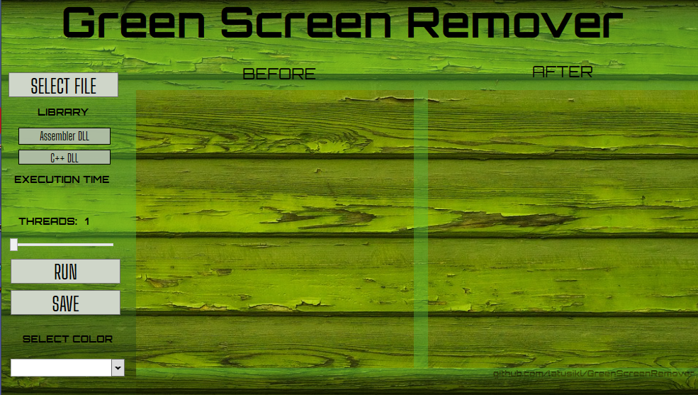
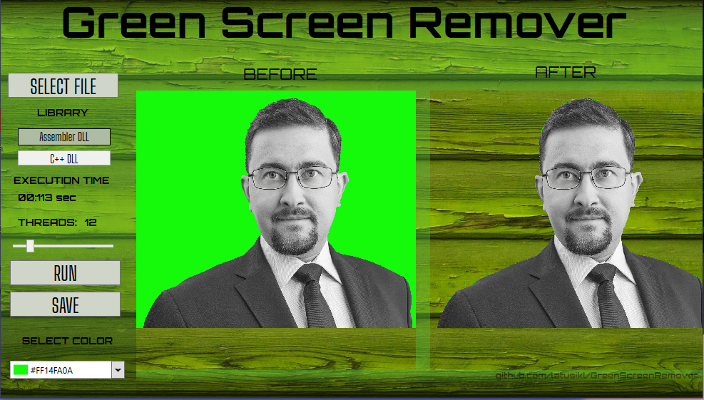

Green Screen Remover
---
#### Initial informations ####
In this repository you will find application which can be used to remove uniform background of given color type.
It allows you to choose between C++ and Assembly DLL library which is used to operate on picture.
Program is working the best with files in *.png* format.

Crucial project facts:
* C# application
* WPF GUI
* Multithreading realized with [SmartThreadPool](https://github.com/amibar/SmartThreadPool) 

Project requirement was to guarantee usage of choosen amount of threads even if it is not optimal. And this bevaviour is not guaranteed by default C# implementation's.

* C++ Dll.
* MASM Dll with usage of SSE.
* Check time of executing algorith.

During processing of big images program may be inresponsive due to splitting picture to arrays with pixels.

---
#### Overview ####

Here you can see pictures of UI:
 
<h4>User interface.<h4/>

 
 
 

<h4>User interface with processed example picture.<h4/>
 

---
#### Usage ####

* Run application (You can try to use provided *.exe* file.)
* Insert picture.
* Choose library.
* Choose color to remove.
* Choose amount of threads.
* Run program.
